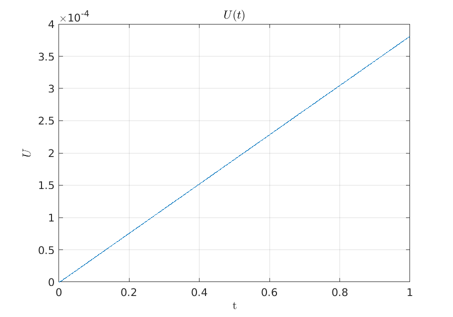

# Портнов Пётр Владимирович, Группа ИУ8-25


## Задание №1 (вариант 24)

### Цели работы:

1. Получение первых навыков работы с системой компьютерной математики MATLAB.

2. Знакомство с основными операциями над векторами и матрицами в MATLAB.

3. Знакомство с простейшими графическими средствами MATLAB.

4. Решение задачи по вычислению суммы числового ряда и анализу погрешностей полученных результатов.

### Условия задачи

Дан ряд:
$$
S = \sum_{n=0}^\infty{a_n} = \sum_{n=0}^\infty{96 \over {n^2 + 9n + 20}}
$$

$$
a_n = {96 \over {n^2 + 9n + 20}}
$$
Найти сумму ряда аналитически. Вычислить значения частичных сумм ряда
$$
S(N) = \sum_{n=0}^N{a_n} = \sum_{n=0}^N{96 \over {n^2 + 9n + 20}}
$$
и найти величину погрешности при значениях:
$$
N=\{10^2, 10^3, 10^4, 10^5\}
$$
Определить количество верных цифр результатов.

### Ход работы

1. Найду сумму ряда S аналитически с использованием средств Matlab:

   ```matlab
   >> syms n
   >> S_inf = symsum(96 / (n^2 + 9*n + 20), n, 0, inf)
    
   S_inf =
    
   24
    
   ```

2. Для решения задачи сумм необходимо знать значение частичных сумм S(N). Решим эту задачу в общем случае:

   ```matlab
   >> syms N
   >> S = symsum(96 / (n^2 + 9*n + 20), n, 0, N)
    
   S =5.2
    
   (24*(N+1))/(N+5)
    
   ```

3. Сформирую вектор N значений, для которых необходимо вычислить величину погрешностей

   ```matlab
   >> N = [10^2, 10^3, 10^4, 10^5]
   
   N =
   
            100        1000       10000      100000
   
   ```

4. Вычислю значения частичных сумм S_i = S(N_i) ряда при соответствующих значениях N_i.
   
   ```matlab
   >> S = (24*(N + 1))./(N + 5)
   
   S =
   
      23.0857   23.9045   23.9904   23.9990
   
   ```

6. Для каждой величины S(N_i) вычислю абсолютную погрешность %DELTA.

   ```matlab
   >> D = abs(S - 24)
   
   D =
   
       0.9143    0.0955    0.0096    0.0010
   
   >> format long
   >> D
   
   D =
   
      0.914285714285715   0.095522388059702   0.009595202398799   0.000959952002400
   
   >> format short e; D
   
   D =
   
      9.1429e-01   9.5522e-02   9.5952e-03   9.5995e-04
   
   ```

   | %DELTA_1  | %DELTA_2  | %DELTA_3  | %DELTA_4  |
   | --------- | --------- | --------- | --------- |
   | 9 * 10^-1 | 1 * 10^-1 | 1 * 10^-2 | 1 * 10^-3 |

7. Для каждой величины S(N_i) вычислю относительную погрешность %delta и определю количество верных цифр.

   ```matlab
   >> d=D./24
   
   d =
   
      3.8095e-02   3.9801e-03   3.9980e-04   3.9998e-05
   
   ```

   | %delta_1  | %delta_2  | %delta_3  | %delta_4  |
   | --------- | --------- | --------- | --------- |
   | 4 * 10^-2 | 4 * 10^-3 | 4 * 10^-4 | 4 * 10^-5 |

8. Для каждой величины S(N_i) определю количество верных цифр.

   ```matlab
   >> a = [2 2 2 2]
   
   a =
   
        2     2     2     2
   
   >> n = 1 - log10(a .* d)
   
   n =
   
      2.1181e+00   3.0991e+00   4.0971e+00   5.0969e+00
   
   >> n = floor(n)
   
   n =
   
        2     3     4     5
   ```

9. Запишу численные значения найденных частичных сумм, округлив их до найденного ранее количества верных цифр.

   ```matlab
   >> format long; S
   
   S =
   
     23.085714285714285  23.904477611940298  23.990404797601201  23.999040047997600
   
   ```

   | S_1  | S_2  | S_3   | S_4    |
   | ---- | ---- | ----- | ------ |
   | 23   | 23.9 | 23.99 | 23.999 |

10. Построю график зависимости относительной погрешности в процентах от N.

   ```matlab
   >> semilogx(N, d * 100) % домножаю x на 100, т.к. относ. погрешность в процентах
   ```

   - Подписываю оси координат:

     ```matlab
     >> xlabel('N')
     >> ylabel('Относительная погрешность (%)')
     ```

   - Включаю отображение координатной сетки:

     ```matlab
     >> grid on
     ```

   - Даю графику название:

     ```matlab
     >> title('График зависимости относительной погрешности в процентах от N')
     ```


### Выводы

В ходе работы были изучены основные средства работы с данными в среде MATLAB, базовые синтаксические структуры языка, методы построение графиков. Были изучены методики вычисления различных погрешностей при вычислениях и закономерности, наблюдаемые при этом. Так при увеличении значения параметра N можно наблюдать спад погрешности (что отображено на графике).  

## Задание №2

### Цели работы:

1. Введение в программирование в MATLAB.
2. Решение систем линейных алгебраических уравнений с помощью матричных операторов MATLAB.
3. Численное решение нелинейных уравнений в MATLAB.
4. Решение нелинейного уравнения из предметной области.

### Задача 1 (вариант 24)

#### Условия задачи

Построить график с целью нахождения отрезка локализации, на котором находится только один корень, и найти **данный** корень нелинейного уравнения.

$$
x + ln(x) - 0.5 = 0
$$

#### Ход работы

1. Создаю файл `f1.m` и описываю в нём функцию `f1`, соответствующую данному выражению:

   ```matlab
   function result = f1(x)
       result = x + log(x) - 0.5;
   end
   ```

2. Создаю файл `task_2_1.m` и описываю в нём исходную программу отрисовки графика функции:

   ```matlab
   x = -1 : 0.0001: 1; % рассматриваем отрезок [-1; 1] с шагом 0.0001
   y = f1(x);
   plot(x, y);
   grid on;
   ```

   И запускаю

3. Через графическое меню подписываю оси на отрисованном графике и помечаю приблизительно точку пересечения графика функции с осью Ox

4. Дополняю код скрипта строчкой (используется функция `fprintf` вывода сообщения в стандартный поток вывода)

   ```matlab
   x0 = fzero('f1(x)', [0.7, 0.8]); % т.к. на графике видно,
   % что искомое значение находится в пределах этого отрезка
   fprintf('Функция принимает значение равное нулю при x = %d\n', x0);
   ```

5. Программа выводит следующее сообщение:

   ```matlab
   Функция принимает значение равное нулю при x = 7.662486e-01
   ```

### Задача 2 (вариант 8)

#### Условия задача

1. Введение в программирование в MATLAB.
2. Решение систем линейных алгебраических уравнений с помощью матричных операторов MATLAB.
3. Численное решение нелинейных уравнений в MATLAB.
4. Решение нелинейного уравнения из предметной области.

В гибридных интегральных схемах в качестве одновитковой индуктивности может применяться тонкая металлическая полоска, нанесенная на диэлектрическую подложку в виде круглой петли. Индуктивность такой петли в наногенри приближенно определяется по формуле
$$
L = 1.257 R \left[ln{\left({8 \pi R} \over {W + t}\right)} - 2\right]
$$
где R - радиус средней петли, W - ширина металлической полоски, t - её толщина.

Все размеры в формуле указаны в мм.

Найти размер R, удовлетворяющий требуемому значению L при заданных параметрах W и t (их значения указаны в таблице):

| Параметр / Вариант | 8-1  | 8-2   | 8-3  | 8-4   | 8-5  | 8-6   |
| ------------------ | ---- | ----- | ---- | ----- | ---- | ----- |
| W, мм              | 0.5  | 2     | 1    | 1.25  | 1.5  | 0.75  |
| t, мм              | 0.03 | 0.035 | 0.01 | 0.035 | 0.03 | 0.025 |
| L, нГн             | 25   | 72    | 60   | 37    | 45   | 42    |

Иначе говоря, необходимо для каждого столбца найти такое значение R, при котором


$$
1.257 R \left[ln{\left({8 \pi R} \over {W + t}\right)} - 2\right] - L = 0
$$

#### Ход работы


1. Создаю файл `f1.m` и описываю в нём функцию `f1`, соответствующую данному выражению:

   ```matlab
   function result = f2(R, W, t, L)
       result = 1.257 * R .* (log(8 * pi * R ./ (W + t)) - 2) - L;
   end
   ```

2. Создаю файл `task_2_2.m` и описываю в нём исходную программу отрисовку графика функции:

   ```matlab
   W = 0.5;
   t = 0.03;
   L = 25;
   R = 0.001 : 0.001 : 10;
   
   y = f2(R, W, t, L);
   plot(R, y);
   grid on;
   xlabel('R')
   ylabel('delta')
   ```

3. Как и в задании 2.1, для удобства делаю необходимые пометки на графике

4. Вычисляю точное значение R в точке пересечения графика с осью Ox, используя синтаксис *function handle*:

   ```matlab
   fzero(@(R) f2(R, W, t, L), [4, 6])
   ```

5. Получаю вывод программы:

   ```matlab
   
   ans =
   
      5.562968775217576
   
   ```

6. Повторяю аналогичные действия для остальных наборов {W, t, L}:

   1. Столбец 8-2

      ```matlab
      W = 2;
      t = 0.035;
      L = 72;
      R = 15 : 0.001 : 20;
      ```

      ```matlab
      fzero(@(R) f2(R, W, t, L), [15, 20])
      ```

      ```matlab
      
      ans =
      
        17.087855350981926
      
      ```

   2. Столбец 8-3

      ```matlab
      W = 1;
      t = 0.01;
      L = 60;
      R = 10 : 0.001 : 20;
      ```

      ```matlab
      fzero(@(R) f2(R, W, t, L), [10, 15])
      ```

      ```matlab
      
      ans =
      
        12.707094812101273
      
      ```

   3. Столбец 8-4

      ```matlab
      W = 1.25;
      t = 0.035;
      L = 37;
      R = 8 : 0.001 : 10;
      ```

      ```matlab
      fzero(@(R) f2(R, W, t, L), [9, 9.5])
      ```

      ```matlab
      
      ans =
      
         9.215045930623093
      
      ```

   4. Столбец 8-5

      ```matlab
      W = 1.5;
      t = 0.03;
      L = 45;
      R = 10 : 0.001 : 15;
      ```

      ```matlab
      fzero(@(R) f2(R, W, t, L), [10, 12])
      ```

      ```matlab
      
      ans =
      
        11.150996607511026
      
      ```

   5. Столбец 8-6

      ```matlab
      W = 0.75;
      t = 0.025;
      L = 42;
      R = 5 : 0.001 : 10;
      ```

      ```matlab
      fzero(@(R) f2(R, W, t, L), [8, 10])
      ```

      ```matlab
      
      ans =
      
         9.069718583786369
      
      ```

### Выводы

Были изучены средства MATLAB для решения линейных и нелинейных уравнений, использованы знания по технологии построения графиков для графической иллюстрации решения. Также был изучен синтаксис *function handle*, используемый для локального определения функций (аналог лямбд из языков программирования общего предназначения).

## Задание 3 (вариант 24)

### Цели работы

1. Дальнейшее введение в программирование в MATLAB.
2. Решение систем линейных алгебраических уравнений с помощью матричных операторов MATLAB.
3. Решение систем линейных алгебраических уравнений методом итераций.

### Условия задачи

$$
A = 
\begin{pmatrix}
3 & 20 & -2 & 0\\
5 & -4 & 0 & 20\\
0 & 5 & 32 & -3\\
12 & 0 & 0 & 3
\end{pmatrix}
$$

$$
B =
\begin{pmatrix}
41 \\ -19 \\ 34 \\ 29
\end{pmatrix}
$$

$$
A X = B
$$

- Решить систему линейных алгебраических уравнений матричными средстами MATLAB:
  - Предварительно убедиться, что система уравнений невырожденная.
  - Выполнить проверку решения.
  - Решить задачу, используя четыре различных способа.
- Решить систему линейных алгебраических уравнений методом простых итераций.
  - Решить задачу, используя два способа приведения уравнения AX = B к виду, пригодному для решения методом простых итераций
  - Сравнить результаты.

#### Решение матричными средствами MATLAB

Решение:

СЛАУ записывается в виде
$$
A X = B
$$
где
$$
X =
\begin{pmatrix}
x_1 \\ x_2 \\ x_3 \\ x_4
\end{pmatrix}
$$
Тогда
$$
X = A^{-1} B
$$
Проверю, что система уравнений невырожденная, т.е. что определитель матрицы `A` не равен нулю:

Листинг скрипта `task_3.m` (начало)

```matlab
A = [
    3 20 -2 0;
    5 -4 0 20;
    0 5 32 -3;
    12 0 0 3
];
B = [
    41;
    -19;
    34;
    29
];

% Проверяю матрицу на невырожденность
assert(det(A) ~= 0, 'Матрица является вырожденной');
```

Для проверки выражения на истинность я воспользовался встроенной функцией `assert`, которая выводит сообщение об ошибке (справа) в случае невыполнения условия (слева).

Описываю функции для нахождения решения СЛАУ:

1. Использование обратной матрицы (первый способ, синтаксис `inv(Matrix)`):

   ```matlab
   function X = task_3_1_1(A, B)
       % Отключаю рекомендацию MATLAB, советующую
       % явно использовать оператор деления матриц
       X = inv(A) * B; %#ok<MINV>
   end
   ```

   Среда Matlab выдаёт предупреждение о том, что данный способ менее эффективен, чем способ 3.

2. Использование обратной матрицы (второй способ, синтаксис `Matrix^-1`):

   ```matlab
   function X = task_3_1_2(A, B)
       X = A^-1 * B;
   end
   ```

3. Метод Гаусса (первый способ, оператор правого деление `\`):

   ```matlab
   function X = task_3_1_3(A, B)
       X = A \ B;
   end
   ```

4. Метод Гаусса (второй способ, оператор левого деления `/`  и оператор транспонирования `'`'):

   ```matlab
   function X = task_3_1_4(A, B)
       X = (B' / A')';
   end
   ```

Размещаю данные функции в одноимённых файлах и вызываю из из основного скрипта

Листинг скрипта `task_3.m` (продолжение)

```matlab
% Решаю СЛАУ матричными средствами MATLAB
fprintf('%s:\n%s\n%s:\n%s\n%s:\n%s\n%s:\n%s\n',...
    'Решение полученное способом #1.1', task_3_1_1(A, B),...
    'Решение полученное способом #1.2', task_3_1_2(A, B),...
    'Решение полученное способом #1.3', task_3_1_3(A, B),...
    'Решение полученное способом #1.4', task_3_1_4(A, B)...
)
```

Снова использую встроенную функцию `fprintf` для форматированного вывода текста.

Результат выполнения программы:

```matlab
Решение полученное способом #1:
2.740101e+00
1.706443e+00:
6.745805e-01
-1.293737e+00:
Решение полученное способом #2
2.740101e+00:
1.706443e+00
6.745805e-01:
-1.293737e+00
Решение полученное способом #3:
2.740101e+00
1.706443e+00:
6.745805e-01
-1.293737e+00:
Решение полученное способом #4
2.740101e+00:
1.706443e+00
6.745805e-01:
-1.293737e+00
```

#### Решение методом простых итераций

1. Выношу методы приведения матриц в отдельные функции:

   ```matlab
   function [a, b] = task_3_2_1(A, B)
       a = zeros(4, 4);
       b = zeros(4, 1);
   
       % Выставляю по диагонали наибольшие элементы
       for col = 1 : 4
           for row = col : 4
               if A(row, col) > A(col, col)
                   % Обмен строками
                   A([row col], :) = A([col row], :);
                   B([row col], :) = B([col row], :);
               end
           end
       end
       
       % "Причёсываю матрицу"
       for i = 1 : 4
           b(i) = B(i) / A(i, i);
           a(i, i) = 0;
           for j = 1 : 4
               if i ~= j
                   a(i, j) = -A(i, j) / A(i, i);
               end
           end
       end
   end
   ```

   ```matlab
   function [a, b] = task_3_2_2(A, B, e)
       d = e * ones(4, 4);
       a = d * A;
       b = (A^-1 - d) * B;
   end
   ```

2. Выношу собственную функцию решения СЛАУ  в файл `task_3_2_2.m`:

   ```matlab
   function X = task_3_2(A, B, e)
       assert(norm(A) < 1, 'Итерационный процесс не сходится');
   
       limit = (1 - norm(A)) / norm(A) * e;
   
       previousX = B;
       currentX = A * previousX + B;
       while norm(currentX - previousX) > limit
           previousX = currentX;
           currentX = A * previousX + B;
       end
   
       X = currentX;
   end
   ```

3. Вызываю свои функции в скрипте и вывожу погрешность:

   Листинг скрипта `task_3.m` (завершение)

   ```matlab
   % Привожу матрицу к необходимому виду 1 способом
   [A1, B1] = task_3_2_1(A, B);
   % Привожу матрицу к необходимому виду 2 способом
   [A2, B2] = task_3_2_2(A, B, 1e-5);
   
   X1 = task_3_2(A1, B1, 1e-5);
   X2 = task_3_2(A2, B2, 1e-5);
   % Решаю СЛАУ при помощи собственных реализаций алгоритма
   fprintf('%s:\n%s\n%s:\n%s\n',...
       'Решение с иcпользованием матрицы, полученной способом #2.1', X1,...
       'Решение с иcпользованием матрицы, полученной способом #2.2', X2...
       ...
   )
   fprintf('%s: %s\n%s: %s\n',...
       'Погрешность при решении для матриц 2.1', norm(A * X1 - B),...
       'Погрешность при решении для матриц 2.2', norm(A * X2 - B)...
   )
   ```

### Выводы

Были рассмотрены различные средства MATLAB для решения СЛАУ, заданных в виде матриц. Как видно, MATLAB обладает разнообразием средств для данной задачи, среди которых как наличие явных матричных операторов, так и средства языков программирования вроде функций и циклов. Кроме того, была использована функция `assert`, использующаяся для валидации данных. 


## Задание №4 (Вариант 24): Численное интегрирование

### Цели работы:

1. Исследование методов численного интегрирования в MATLAB.
2. Изучение средств аналитического и численного интегрирования, имеющихся в MATLAB.
3. Программирование циклических алгоритмов в MATLAB.

### Задача 1

#### Условия задачи

Вычислить значение интеграла
$$
I = \int_{1}^{1.44}P_n(x)dx
$$
где
$$
P_n(x) = \sum_{i=0}^{n}c_{i}x^{i}
$$
с помощью квадратурных формул левых прямоугольников, средних прямоугольников, трапеций и Симпсона для элементарного отрезка интегрирования. Оценить величину погрешности. Применяя те же квадратурные формулы для составного отрезка интегрирования, вычислить интеграл *I* с точностью 0.0001. Предварительно оценить шаг интегрирования, при котором достигается заданная точность.

#####  Часть Ⅰ. Элементарный метод.

1. Задать функцию
   $$
   f(x) = P_{n}(x)
   $$
   

   в m-файле функции.

2. Вычислить значение интеграла *I* аналитически, т.е. найти его точное значение.

3. Построить график функции на отрезке [a, b].

4. Вычислить значение интеграла *I* по формулам левых прямоугольников, средних прямоугольников, трапеций и Симпсона, считая отрезок [1, 1.44] элементарным отрезком интегрирования.

5. Найти абсолютные и относительные погрешности результатов. Результаты занести в таблицу.

##### Часть Ⅱ. Составной метод.

1. Используя выражение для остаточных членов интегрирования R, оценить шаг интегрирования **h** и количество узлов интегрирования **n**, при которых величина погрешности каждой квадратурной формулы будет меньше 0.0001.
2. Вычислить значения интеграла по составной квадратурной формуле с найденными **h** и **n**.
3. Найти абсолютные погрешности результатов.
4. Результаты занести в таблицу.

#### РешениеСоздаю m-файл `Mi.m`, содержащий в себе функцию для вычисления `i`'х значения `M`:

```matlab
function result = Mi(f, i, a, b)
    % Вычисляет значение M_i для заданной функции

    % Для вычисления производной необходимо объявить символьную переменную;
    % дабы избежать конфликтов имён, использую `__` в конце названия
    syms x__
    diffI = matlabFunction(diff(f(x__), i));
    result = max(abs(diffI(a : 0.00001 : b)));
end
```

Создаю m-файлы `print_int_data.m` и `print_complex_int_data.m`, содержащие в себе процедуры для вывода необходимых данных:

```matlab
function print_int_data(name, I0, I, R)
    fprintf('%s:\n', name);
    fprintf('\tЗначение: %d\n', I);
    D = abs(I0 - I);
    fprintf('\tАбс. погрешность: %d\n', D);
    fprintf('\tОтн. погрешность: %d\n', D ./ I);
    fprintf('\tТеор. абс. погрешность: %d\n', R);
    fprintf('\tТеор. отн. погрешность: %d\n', R ./ I);
end
```

```matlab
function print_complex_int_data(name, I0, I, n, h)
    fprintf('%s:\n', name);
    fprintf('\tШаг интегрирования: %d\n', h);
    fprintf('\tКол-во узлов интегрирования: %d\n', n);
    fprintf('\tЗначение: %d\n', I);
    D = abs(I0 - I);
    fprintf('\tАбс. погрешность: %d\n', D);
    fprintf('\tОтн. погрешность: %d\n', D ./ I);
end
```

Определяю методы левых прямоугольников, средних прямоугольников, трапеций и Симпсона в файлах `int_lrect.m`, `int_mrect.m`, `int_trapz.m` и `int_simpson.m` соответственно:

```matlab
function I = int_lrect(f, a, b, n)
    h = (b - a) / n;

    I = 0;
    for i = 1 : n
        I = I + f(a + i * h);
    end
    I = h * I;
end
```

```matlab
function I = int_mrect(f, a, b, n)
    h = (b - a) / n;

    I = 0;
    for i = 1 : n
        I = I + f(a + i * h);
    end
    I = I * h;
end
```

```matlab
function I = int_trapz(f, a, b, n)
    h = (b - a) / n;

    I = (f(a) + f(b)) / 2;
    for i = 1 : (n - 1)
        I = I + f(a + i * h);
    end
    I = I * h;
end
```

```matlab
function I = int_simpson(f, a, b, n)
    % Вычисление интеграла методом Симпсона
    
    h = (b - a) / n;
    
    I = f(a) + f(b) + 4 * f(a + + h/2);
    for i = 1 : (n-1)
        I = I + 4 * f(a + i * h + h/2) + 2 * f(a + i * h);
    end
    I = I * h / 6;
end
```

Далее создаю скрипт, выполняющий обе части задания и использующий описанные выше функции:

Листинг скрипта `task_4_1.m`

```matlab
% Устанавливаю постоянные, участвующие в выражении P_n(x)
C0 = 1.3;
C1 = 0.5;
C2 = 2.1;
C3 = 5.7;
C4 = 8.3;
C5 = -3.7;
% Записываю формулу для P_n(x)
Pn = @(x) C0 + C1 * x + C2 * x.^2 + C3 * x.^3 + C4 * x.^4 + C5 * x.^5;

% Устанавливаю элементарные границы интегрирования
a = 1;
b = 1.44;

disp('~~~~~~~~~~ Часть 1 ~~~~~~~~~~')

% Устанавливаю, что f(x) = P_n(x)
f = Pn;

% Вычисляю точное значение интеграла, используя встроенные средства Matlab
I0 = integral(f, a, b);

% Строю график функции на отрезке [a = 0, b = pi]
fplot(f, [0, pi]);
% Настраиваю отображение графика
grid on
title('$f(x) = P_{n}(x)$', 'Interpreter', 'latex')
xlabel 'x'
ylabel 'y'

fprintf('Значение, полученное аналитически: %d\n', I0);

% Высчитываю необходимые далее значение M_i
M1 = Mi(f, 1, a, b);
M2 = Mi(f, 2, a, b);
M4 = Mi(f, 4, a, b);

% Вычисляю длину элементарного отрезка интегрирования
h = b - a;

% Вычисляю значение интеграла различными методами
% и высчитываю их теоретическую и фактическую погрешности
print_int_data(...
    'Метод левых прямоугольников',...
    I0, h * f(a),...
    M1 * (b - a) * h / 2 ...
);
print_int_data(...
    'Метод средних прямоугольников',...
    I0, h * f((a + b) / 2),...
    M2 * (b - a) * h^2 / 24 ...
);
print_int_data(...
    'Метод трапеций',...
    I0, h * (f(a) + f(b)) / 2,...
    M2 * (b - a) * h^2 / 12 ...
);
print_int_data( ...
    'Метод Симпсона',...
    I0, h / 6 * (f(a) + 4 * f((a + b) / 2) + f(b)),...
    M4 * (b - a) * h^4 / 2880 ...
);

disp('~~~~~~~~~~ Часть 2 ~~~~~~~~~~')

% Устанавливаю границу допустимой погрешности
R = 0.0001;

% Метод левых прямоугольников
h = R * 2 / ((b - a) * M1);
n = ceil((b - a) / h);

print_complex_int_data(...
    'Метод левых прямоугольников', I0, int_lrect(f, a, b, n), n, h...
);

% Метод средних прямоугольников
h = (R * 24 / ((b - a) * M2)) ^ 0.5;
n = ceil((b - a) / h);

print_complex_int_data(...
    'Метод средних прямоугольников', I0, int_mrect(f, a, b, n), n, h...
);

% Метод трапеций
h = (R * 12 / ((b - a) * M2)) ^ 0.5;
n = ceil((b - a) / h);

print_complex_int_data(...
    'Метод трапеций', I0, int_trapz(f, a, b, n), n, h...
);

% Метод Симпсона
h = (R * 2880 / ((b - a) * M4)) ^ 0.25;
n = ceil((b - a) / h);

print_complex_int_data(...
    'Метод Симпсона', I0, int_simpson(f, a, b, n), n, h...
);
```

Вывод скрипта

```matlab
>> task_4_1
~~~~~~~~~~ Часть 1 ~~~~~~~~~~
Значение, полученное аналитически: 1.066952e+01
Метод левых прямоугольников:
	Значение: 6.248000e+00
	Абс. погрешность: 4.421515e+00
	Отн. погрешность: 7.076689e-01
	Теор. абс. погрешность: 5.962359e+00
	Теор. отн. погрешность: 9.542828e-01
Метод средних прямоугольников:
	Значение: 1.046022e+01
	Абс. погрешность: 2.092938e-01
	Отн. погрешность: 2.000855e-02
	Теор. абс. погрешность: 2.280745e-01
	Теор. отн. погрешность: 2.180398e-02
Метод трапеций:
	Значение: 1.108222e+01
	Абс. погрешность: 4.127043e-01
	Отн. погрешность: 3.724022e-02
	Теор. абс. погрешность: 4.561490e-01
	Теор. отн. погрешность: 4.116044e-02
Метод Симпсона:
	Значение: 1.066755e+01
	Абс. погрешность: 1.961129e-03
	Отн. погрешность: 1.838405e-04
	Теор. абс. погрешность: 2.520470e-03
	Теор. отн. погрешность: 2.362744e-04
~~~~~~~~~~ Часть 2 ~~~~~~~~~~
Метод левых прямоугольников:
	Шаг интегрирования: 7.379630e-06
	Кол-во узлов интегрирования: 59624
	Значение: 1.066960e+01
	Абс. погрешность: 8.107853e-05
	Отн. погрешность: 7.599025e-06
Метод средних прямоугольников:
	Шаг интегрирования: 9.213281e-03
	Кол-во узлов интегрирования: 48
	Значение: 1.077040e+01
	Абс. погрешность: 1.008886e-01
	Отн. погрешность: 9.367209e-03
Метод трапеций:
	Шаг интегрирования: 6.514773e-03
	Кол-во узлов интегрирования: 68
	Значение: 1.066960e+01
	Абс. погрешность: 8.755655e-05
	Отн. погрешность: 8.206168e-06
Метод Симпсона:
	Шаг интегрирования: 1.963732e-01
	Кол-во узлов интегрирования: 3
	Значение: 1.066949e+01
	Абс. погрешность: 2.421147e-05
	Отн. погрешность: 2.269224e-06
```


Для оформления графика использовался формат LaTeX.

### Задача 2

#### Условия задачи

Вычислить заданный интеграл аналитически и используя квадратурную формулу, указанную в индивидуальном варианте, с шагом *h=(b-a)/8*. Оценить погрешность по правилу Рунге. Сравнить данную оценку погрешности с точным значением погрешности. Сделать выводы.

#### Решение

Листинг скрипта `task_4_2.m`

```matlab
% Нижняя граница интегрования
a = 0;
% Верхняя граница интегрирования
b = pi;

% Исходная функция
f = @(x) cos(x);

% Значение, вычисленное аналитически
I0 = integral(f, a, b);
fprintf('Значение, вычисленное аналитически: %d\n', I0);

% Количество узлов интегрирования
n = 8;

% Метод Симпсона
I = int_simpson(f, a, b, n);
fprintf('Значение, вычисленное методом Симпсона: %d\n', I);

% Вычисление погрешности по правилу Рунге
D = abs(I - int_simpson(f, a, b, 2 * n));
fprintf('Абсолютная погрешность по правилу Рунге: %d\n', D);
fprintf('Относительная погрешность по правилу Рунге: %d\n', abs(I0 / D));

% Вычисление точной погрешности
D = abs(I0 - I);
fprintf('Абсолютная погрешность: %d\n', D);
fprintf('Относительная погрешность: %d\n', abs(I0 / D));
```

Результат выполнения скрипта

```matlab
>> task_4_2
Значение, вычисленное аналитически: 1.110223e-16
Значение, вычисленное методом Симпсона: 8.719671e-17
Абсолютная погрешность по правилу Рунге: 1.307951e-16
Относительная погрешность по правилу Рунге: 8.488264e-01
Абсолютная погрешность: 2.382559e-17
Относительная погрешность: 4.659792e+00
```

### Задача 3

#### Условия задачи

1. Оценить погрешность численного интегрирования с помощью функции **trapz(x,y)** (метод трапеций).
2. Для функции **quad('fun',a,b,tol)** (метод Симпсона) убедится, что результат действительно вычисляется с точностью tol.

#### Решение

Листинг скрипта `task_4_3.m`

```matlab
% Нижняя граница интегрирования
a = 1;
% Верхняя граница интегрирования
b = pi;
% Произвольная функция
f = @(x) x + x .* x + x .^ 3;

n = 1000;
h = (b - a) / n;
% Интегрирование с помощью функции trapz
x = a : h : b;
I = trapz(x, f(x));
fprintf('Значение, полученное при помощи функции trapz: %d\n', I);

% Интегрирование с помощью собственной реализации метода трапеции
I0 = int_trapz(f, a, b, n);
fprintf('Значение, полученное при помощи своей функции: %d\n', I0);

D = abs(I - I0);
fprintf('Абсолютная погрешность: %d\n', D);
fprintf('Относительная погрешность: %d\n', abs(I0 / D));

% Проверка соблюдения функцией quad контракта на параметр tol
for i = 1 : 10
    tol = 10^(-i);
    fprintf('Точность: %d\n', tol);

    n = ceil((b - a) * (tol * 2880 / ((b - a) * M4)) ^ 0.25);

    % Интегрирование с помощью функции quad;
    % Matlab включает предупреждение об использовании quad вместо integral,
    % которое необходимо явно отключить для данной строчки
    I = quad(f, a, b, tol); %#ok<DQUAD>
    fprintf('\tЗначение, полученное при помощи функции quad: %d\n', I);

    % Интегрирование с помощью собственной реализации метода Симпсона
    I0 = int_simpson(f, a, b, n);
    fprintf('\tЗначение, полученное при помощи своей функции: %d\n', I0);

    D = abs(I - I0);
    fprintf('\tАбсолютная погрешность: %d\n', D);
    fprintf('\tОтносительная погрешность: %d\n', abs(I0 / D));
    assert(D < tol);
end
```

Результат выполнения скрипта

```matlab
>> task_4_3
Значение, полученное при помощи функции trapz: 3.853918e+01
Значение, полученное при помощи своей функции: 3.853918e+01
Абсолютная погрешность: 0
Относительная погрешность: Inf
Точность: 1.000000e-01
	Значение, полученное при помощи функции quad: 3.853917e+01
	Значение, полученное при помощи своей функции: 3.853917e+01
	Абсолютная погрешность: 0
	Относительная погрешность: Inf
Точность: 1.000000e-02
	Значение, полученное при помощи функции quad: 3.853917e+01
	Значение, полученное при помощи своей функции: 3.853917e+01
	Абсолютная погрешность: 0
	Относительная погрешность: Inf
Точность: 1.000000e-03
	Значение, полученное при помощи функции quad: 3.853917e+0124
	Значение, полученное при помощи своей функции: 3.853917e+01
	Абсолютная погрешность: 0
	Относительная погрешность: Inf
Точность: 1.000000e-04
	Значение, полученное при помощи функции quad: 3.853917e+01
	Значение, полученное при помощи своей функции: 3.853917e+01
	Абсолютная погрешность: 0
	Относительная погрешность: Inf
Точность: 1.000000e-05
	Значение, полученное при помощи функции quad: 3.853917e+01
	Значение, полученное при помощи своей функции: 3.853917e+01
	Абсолютная погрешность: 0
	Относительная погрешность: Inf
Точность: 1.000000e-06
	Значение, полученное при помощи функции quad: 3.853917e+01
	Значение, полученное при помощи своей функции: 3.853917e+01
	Абсолютная погрешность: 0
	Относительная погрешность: Inf
Точность: 1.000000e-07
	Значение, полученное при помощи функции quad: 3.853917e+01
	Значение, полученное при помощи своей функции: 3.853917e+01
	Абсолютная погрешность: 0
	Относительная погрешность: Inf
Точность: 1.000000e-08
	Значение, полученное при помощи функции quad: 3.853917e+01
	Значение, полученное при помощи своей функции: 3.853917e+01
	Абсолютная погрешность: 0
	Относительная погрешность: Inf
Точность: 1.000000e-09
	Значение, полученное при помощи функции quad: 3.853917e+01
	Значение, полученное при помощи своей функции: 3.853917e+01
	Абсолютная погрешность: 0
	Относительная погрешность: Inf
Точность: 1.000000e-10
	Значение, полученное при помощи функции quad: 3.853917e+01
	Значение, полученное при помощи своей функции: 3.853917e+01
	Абсолютная погрешность: 0
	Относительная погрешность: Inf
```

### Выводы

Были изучены средства MATLAB для работы с интегралами, а также способы их самостоятельной реализации. Кроме того, стандартные функции MATLAB были проверены на соблюдение контракта (а именно на гарантированную ими точность). Наконец, были использованы некоторые косвенно пригодившиеся функции, как, например, `matlabFunction` для преобразования символьной функции в function handle и сторонние средства вроде языка TeX.

## Задание №5

### Часть 1 (Вариант 24)

#### Условия задачи

Построить график и вывести в виде таблицы решение задачи Коши на интервале *[0; 1]* методом Рунге-Кутта 4-го порядка.

#### Решение

Листинг скрипта `task_5_1.m`:

```matlab
% Задаю функцию f(x, y)
f = @(x, y) log(1 + x^2) + y;

% Устаналиваю значение y_0
y0 = 0.6;

% Решаю диференциальное уравнение при помощи встроенной функции
[X, Y] = ode45(f, [0 1], y0);

% Строю график по точкам
plot(X, Y);
title 'График численного решения y(x)';
xlabel 'x';
ylabel 'y';

% Вывожу результат в виде таблицы
fprintf('|—————————————————|\n|    x   |    y   |\n|--------|--------|\n');
i = 0;
for x = X
    i = i + 1;
    fprintf('|%f|%f|\n', x, y(i));
end
fprintf('|—————————————————|\n')
```

Результат выполнения скрипта

```matlab
>> task_5_1
|—————————————————|
|    x   |    y   |
|--------|--------|
|0.000000|0.025000|
|0.050000|0.075000|
|0.100000|0.125000|
|0.150000|0.175000|
|0.200000|0.225000|
|0.250000|0.275000|
|0.300000|0.325000|
|0.350000|0.375000|
|0.400000|0.425000|
|0.450000|0.475000|
|0.500000|0.525000|
|0.550000|0.575000|
|0.600000|0.625000|
|0.650000|0.675000|
|0.700000|0.725000|
|0.750000|0.775000|
|0.800000|0.825000|
|0.850000|0.875000|
|0.900000|0.925000|
|0.950000|0.975000|
|1.000000|0.600000|
|—————————————————|
```

Решение задачи Коши на интервале *[0, 1]* в виде таблицы

| x        | y        |
| -------- | -------- |
| 0.000000 | 0.025000 |
| 0.050000 | 0.075000 |
| 0.100000 | 0.125000 |
| 0.150000 | 0.175000 |
| 0.200000 | 0.225000 |
| 0.250000 | 0.275000 |
| 0.300000 | 0.325000 |
| 0.350000 | 0.375000 |
| 0.400000 | 0.425000 |
| 0.450000 | 0.475000 |
| 0.500000 | 0.525000 |
| 0.550000 | 0.575000 |
| 0.600000 | 0.625000 |
| 0.650000 | 0.675000 |
| 0.700000 | 0.725000 |
| 0.750000 | 0.775000 |
| 0.800000 | 0.825000 |
| 0.850000 | 0.875000 |
| 0.900000 | 0.925000 |
| 0.950000 | 0.975000 |
| 1.000000 | 0.600000 |


### Часть 2 (Вариант 8)

#### Условия задачи

Напряжение с выхода двухполупериодного диодного выпрямителя подается на нагрузку через LC-фильтр, ослабляющий нежелательные пульсации. Зависимости напряжения u на выходе фильтра и общий ток i в цепи от времени t описываются системой дифференциальных уравнений
$$
\begin{cases}
{du \over dt} = {1 \over C} \left(i - {U \over {R_H}}\right)\\
{di \over dt} = {1 \over L} \left[|U_m cos(\omega t)| - i R_0 - u\right]
\end{cases}
$$
где L и C - индуктивность дросселя и емкость конденсатора фильтра, RН - сопротивление  нагрузки, R0 = RВ + RL, RВ - выходное сопротивление выпрямителя, RL - сопротивление обмотки дросселя, Um - амплитуда пульсирующего напряжения на выходе выпрямителя, ω = 2πf - угловая частота.

Рассчитать и построить графики зависимостей
$$
\begin{align*}
& u_В(t) = \left|U_m cos(\omega t)\right|\\
& u(t)\\
& i(t)
\end{align*}
$$
Исходные данные: U_m = 12 В и f = 50 Гц. Начальные условия u(t=0) = 0,  i(t=0) = 0. Параметры R_0, R_Н, L и C приведены в таблице.

| Параметр / Вариант | 8-1  | 8-2  | 8-3  | 8-4  | 8-5  | 8-6  |
| ------------------ | ---- | ---- | ---- | ---- | ---- | ---- |
| R_0, Ом            | 20   | 75   | 35   | 120  | 90   | 20   |
| R_H, Ом            | 500  | 1000 | 750  | 1000 | 2000 | 1000 |
| L, Гн              | 0.5  | 0.7  | 0.1  | 1    | 1.2  | 0.05 |
| C, мкФ             | 100  | 40   | 200  | 50   | 100  | 1000 |

#### Решение

Листинг скрипта `task_5_2.m`

```matlab
% Задаю общие константы
Um = 12;
f = 50;
omega = 2 * pi * f;

% Задаю функцию U_В
UB = @(t) abs(Um * cos(omega * t));

% Устанавливаю исследуемый диапазон
range = 0 : 0.00001 : 0.1;

% Строю график функции U_В
figure(1);
plot(range, UB(range));
grid on;
title('$U_B(t)$', 'Interpreter', 'latex')
xlabel('t', 'Interpreter', 'latex');
ylabel('$U_B$', 'Interpreter', 'latex');
% Сохраняю график в файл
saveas(gcf, 'images/image_5_2.png')

% Наборы значений по вариантам
R0s = [20 75 35 120 90 20];
RHs = [500 1000 750 1000 2000 1000];
Ls = [0.5 0.7 0.1 1 1.2 0.05];
Cs = [100 40 200 50 100 1000];

% Перебор заданий
for variant = 1 : 6    
    % Задаю известные значения
    R0 = R0s(variant);
    RH = RHs(variant);
    L = Ls(variant);
    C = Cs(variant);

    % Задаю функции du/dt и di/dt
    dudt = @(Y) 1 / C * (Y(2) - Y(1) / RH);
    didt = @(t, Y) 1 / L * (UB(t) - Y(2) * R0 - Y(1));

    % Объединяю dudt и didt в единую function handle
    dudidt = @(t, Y) [dudt(Y) didt(t, Y)]';
    [T, UI] = ode45(dudidt, [0, 1], [0, 0]);

    % Строю граифик U(t)
    figure(2);
    plot(T, UI(:, 1));
    title('$U(t)$', 'Interpreter', 'latex')
    grid on;
    xlabel('t', 'Interpreter', 'latex');
    ylabel('$U$', 'Interpreter', 'latex');
    % Сохраняю график в файл
    saveas(gcf, strcat('images/image_5_2_', num2str(variant), '_1.png'))

    % Строю граифик i(t)
    figure(3);
    plot(T, UI(:, 2));
    title('$i(t)$', 'Interpreter', 'latex')
    grid on;
    xlabel('t', 'Interpreter', 'latex');
    ylabel('$i$', 'Interpreter', 'latex');
    % Сохраняю график в файл
    saveas(gcf, strcat('images/image_5_2_', num2str(variant), '_2.png'))
end
```

График *U_В(t)*


График *U(t)_1*


График *i(t)_1*


График *U(t)_2*


График *i(t)_2*


График *U(t)_3*


График *i(t)_3*


График *U(t)_4*


График *i(t)_4*


График *U(t)_5*


График *i(t)_5*


График *U(t)_6*



График *i(t)_6*


### Выводы

Были изучены встроенные средства MATLAB для решения дифференциальных уравнений с довольно высокой точностью, что позволило решить прикладные физические задачи. Кроме того, было автоматизировано сохранение изображений построенных графиков в файлы с автоматической нумерацией.

## Выводы

Среда и язык программирования MATLAB представляют большой спектр прикладных средств для решения теоретических и прикладных математических задач. Использование MATLABом матриц, в качестве основы для всяких вычислений, позволяет выполнять действия сразу над массивами данных единой структуры. Стандартная библиотека обладает достаточным инструментарием для всего спектра вычислительных задач, соответствуя как объектно-ориентированной, так и функциональной парадигмам программирования (яркий пример последнего - function handle).

Особого внимания заслуживают графические средства MATLAB, позволяющие, например, строить произвольные графики с продвинутыми комментариями (в том числе на языке TeX с поддержкой расширения LaTeX)

Стоит отметить, что MATLAB, в первую очередь, является скриптовым интерпретируемым языком программирования, что, с одной стороны, значит довольно простой синтаксис и удобное использование, однако с другой - более долгое исполнение, в сравнении с компилируемыми программами. Несмотря на это, MATLAB показывает достаточную скорость вычислений для решения необходимых задач.

Из негативных составляющих стоит отметить нетипичный синтаксис для индексирования массивов, громоздкий синтаксис для некоторых типичных вещей (многострочные строковые литералы, перенос выражений) , неявную типизацию, устаревшую визуально среду разработки.

Таким образом, MATLAB - это мощный многофункциональный инструмент с разнообразием инструментов и функций, однако для максимальной эффективности работы с ним стоит учитывать особенности технических и синтаксических решений, используемых в нём.